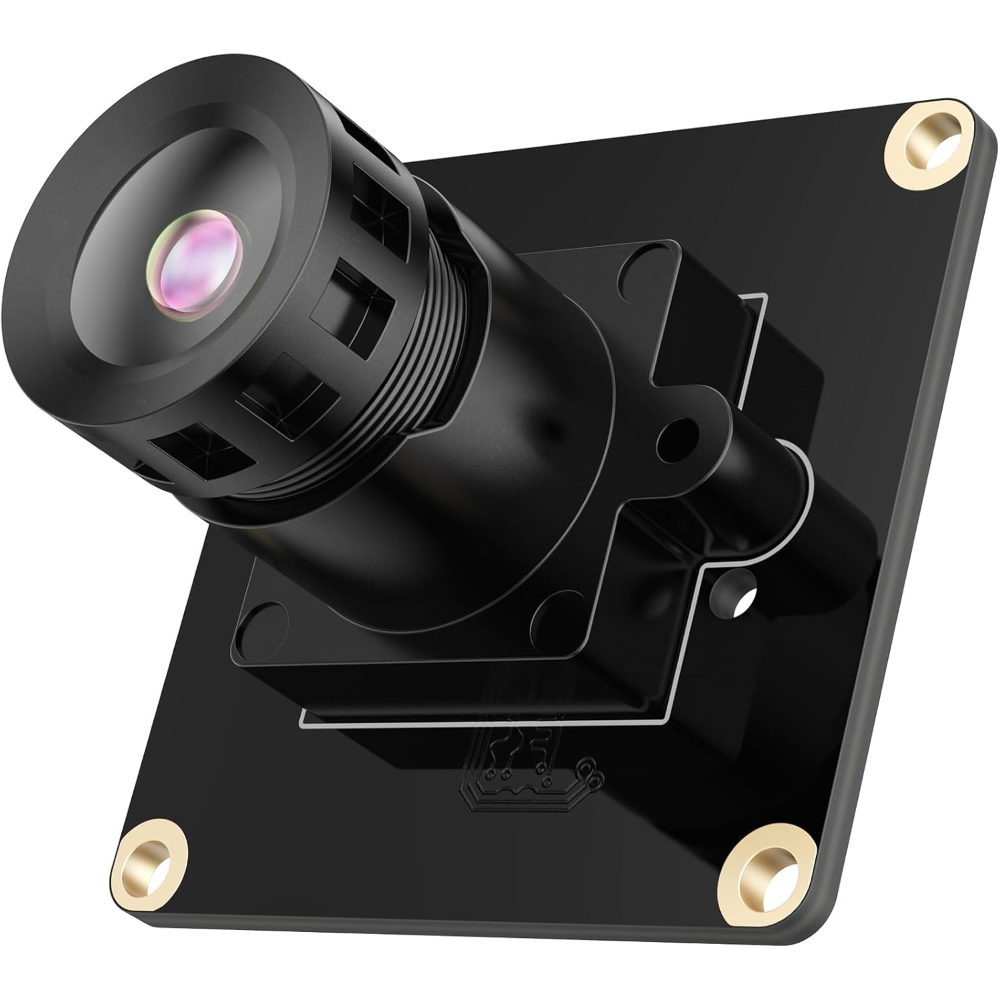

# CAM-IMX577 12MP MIPI Camera Module



## 1. Product Overview

The **CAM-IMX577** is a high-performance 12.3MP MIPI CSI-2 camera module featuring the **Sony IMX577** (IMX477 variant) back-illuminated CMOS sensor. Designed for professional imaging applications on Raspberry Pi 5 and other embedded Linux systems, it delivers exceptional image quality with support for multiple video formats ranging from Full HD to 4K UHD at 30 fps.

With a 1/2.3" optical format, 1.55μm pixel size, and RGGB Bayer pattern, the CAM-IMX577 provides excellent low-light performance, high dynamic range support, and flexible RAW output options (8-bit, 10-bit, 12-bit). The module is fully compatible with the libcamera ecosystem and supports offline compilation for maximum flexibility.

### 1.1 Key Features

- **12.3MP High Resolution** with 4056 × 3040 native resolution
- **Back-illuminated CMOS Sensor** for exceptional low-light performance
- **RGGB Bayer Pattern** for full-color imaging
- **Multiple RAW Output Formats** (8-bit, 10-bit, 12-bit)
- **Flexible Video Formats** - Full resolution to low-power modes at 30 fps
- **MIPI CSI-2 4-lane** high-speed interface
- **On-board Calibration Support** via I2C EEPROM
- **Compatible with Raspberry Pi 5** and Linux-based embedded systems

### 1.2 Industry Applications

- Professional Photography & Videography
- Security & Surveillance Systems
- Industrial Machine Vision
- Drone & UAV Imaging
- Scientific & Research Imaging
- Automotive Vision Systems

---

## 2. Hardware Specifications

### 2.1 Sensor Specifications

| Parameter | Specification |
| :--- | :--- |
| **Product Model** | CAM-IMX577 |
| **Sensor Model** | Sony IMX577 (IMX477 variant) |
| **Sensor Type** | CMOS Image Sensor (Back-illuminated) |
| **Resolution** | 12.3 Megapixels |
| **Max Resolution** | 4056 × 3040 pixels |
| **Optical Format** | 1/2.3" |
| **Pixel Size** | 1.55μm × 1.55μm |
| **Pixel Layout** | RGGB (Bayer Pattern) |
| **Dynamic Range** | High-performance WDR support |
| **Low-light Performance** | Excellent (back-illuminated technology) |
| **Shutter Type** | Rolling shutter |

### 2.2 Video Format & Resolution/Frame Rate

| Pixel Format | Resolution | Frame Rate | Description |
| :--- | :--- | :--- | :--- |
| SRGGB12_CSI2P | 4056 × 3040 | 30.00 fps | 12-bit RAW Full Resolution |
| SRGGB12_CSI2P | 4056 × 2160 | 30.00 fps | 12-bit RAW 4K UHD |
| SRGGB12_CSI2P | 2028 × 1520 | 30.00 fps | 12-bit RAW 2K |
| SRGGB12_CSI2P | 2028 × 1080 | 30.00 fps | 12-bit RAW Full HD |
| SRGGB12_CSI2P | 1332 × 990 | 30.00 fps | 12-bit RAW Low Power |
| SRGGB10_CSI2P | 4056 × 3040 | 30.00 fps | 10-bit RAW Full Resolution |
| SRGGB8 | 4056 × 3040 | 30.00 fps | 8-bit RAW Full Resolution |

*Note: All resolutions support 30fps with stable performance. The 12-bit RAW format provides maximum dynamic range and post-processing flexibility.*

### 2.3 Interface & Physical Specifications

| Parameter | Specification |
| :--- | :--- |
| **Interface Type** | MIPI CSI-2 |
| **Data Lanes** | 2-lane |
| **Connector** | 22-pin 0.5mm Pitch FPC / 15-pin 1.0mm Pitch FPC |
| **Dimensions** | 38mm × 38mm |
| **Lens Mount** | CS-mount / M12 |

---

## 3. Software Support

### 3.1 Repository Contents

This repository provides pre-built drivers, IPA modules, and offline build packages for Raspberry Pi 5 with Debian Trixie/Bookworm.

**Available Components**:

- **`prebuild-driver-ipa/`** - Pre-compiled kernel driver and IPA modules
  - `imx577_trixie_pi5_k6.12.75+rpt-rpi-2712_*.tar.gz` - Ready-to-install driver package for Raspberry Pi 5

- **`libcamera_offline_build.tar.gz`** - Complete offline build package for libcamera with IMX577 support

- **`camera_lens/`** - Compatible lens specifications and documentation
  - Lens compatibility information for various optical configurations

- **`CAM-IMX577-12MP-V10.pdf`** - Complete technical user manual

### 3.2 Driver Installation

#### Option A: Use Pre-built Driver (Recommended)

Extract and install the pre-compiled driver package:

```bash
cd prebuild-driver-ipa
tar -xzf imx577_trixie_pi5_k6.12.75+rpt-rpi-2712_*.tar.gz
cd imx577_driver
chmod +x install.sh
sudo ./install.sh
```

#### Option B: Offline Compilation

For advanced users who need to compile from source:

```bash
tar -xzf libcamera_offline_build.tar.gz
cd libcamera_offline_build
chmod +x build.sh
sudo ./build.sh           # Full mode with Qt support
sudo ./build.sh --lite    # Lite mode (minimal dependencies)
```

**Build Time**: ~30-40 minutes (full mode) or ~15-20 minutes (lite mode)

### 3.3 Manual Configuration

Edit your `/boot/firmware/config.txt` (Pi 5) or `/boot/config.txt` (Pi 4) and add one of the following:

**For CAM0 port**:
```ini
camera_auto_detect=0
dtoverlay=imx577-overlay,cam0
```

**For CAM1 port**:
```ini
camera_auto_detect=0
dtoverlay=imx577-overlay,cam1
```

Reboot your Raspberry Pi for the changes to take effect:
```bash
$ sudo reboot
```

---

## 4. Testing the Camera

After installation and rebooting, verify the camera detection and test functionality using rpicam-apps.

### 4.1 Verify Detection

List available cameras:

```bash
rpicam-hello --list-cameras
```

### 4.2 Capture Commands

**Live Preview:**
```bash
rpicam-hello -t 0
```

**Capture Full Resolution Image (12MP):**
```bash
rpicam-still -o 12mp_image.jpg --width 4056 --height 3040
```

**Capture 4K Image:**
```bash
rpicam-still -o 4k_image.jpg --width 4056 --height 2160
```

**Record 4K Video (30fps):**
```bash
rpicam-vid -t 10000 --width 4056 --height 2160 -o 4k_video.h264
```

**Capture 12-bit RAW:**
```bash
rpicam-raw -t 5000 --width 4056 --height 3040 -o raw_image.dng
```

---

## 5. Compatible Lenses

The camera module supports multiple lens options for different applications:

- **D1326 Lens** - Standard lens configuration (see `camera_lens/D1326镜头.pdf`)
- **YT10089 8MP+ Lens** - High-performance lens with IR-CUT filter (see `camera_lens/YT10089-8MP+H93+IR0160(01.10089.014.08）-8MP座子是IR-CUT.pdf`)

For lens selection and compatibility details, refer to the lens documentation in the `camera_lens/` directory.

---

## 6. Documentation

- **User Manual**: See `CAM-IMX577-12MP-V10.pdf` for comprehensive technical documentation
- **Lens Specifications**: See `camera_lens/` directory for compatible lens information

---

## 7. Support & Licensing

### Source Code Availability

**Note**: Driver source code is not publicly available in this repository. Source code access is provided exclusively to customers who have purchased the CAM-IMX577 camera module. For source code requests, please contact our sales team.

### User Manual

Complete technical documentation is available in `CAM-IMX577-12MP-V10.pdf`. Additional detailed guides and API documentation are coming soon.

### Support

For technical support, product inquiries, and source code access requests, please visit:

*   **Website**: [www.inno-maker.com](https://www.inno-maker.com)
*   **GitHub**: [github.com/INNO-MAKER](https://github.com/INNO-MAKER)
*   **Email**: [support@inno-maker.com](mailto:support@inno-maker.com) | [sales@inno-maker.com](mailto:sales@inno-maker.com)

---

## 8. License & Terms

This repository contains pre-built binaries and offline build packages for the CAM-IMX577 camera module. Use of these materials is subject to the terms and conditions provided by INNO-MAKER.

For detailed licensing information and terms of use, please contact our support team.
